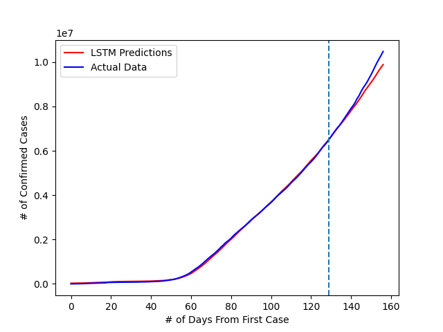
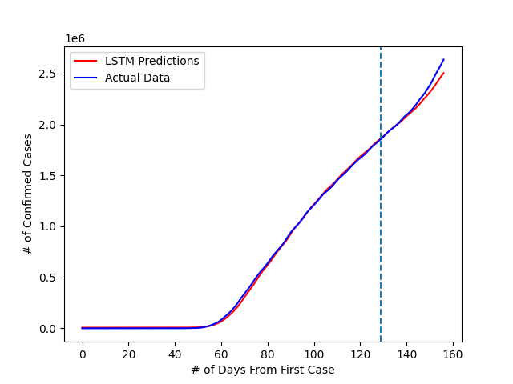

# Predicting Coronavirus Growth Rate using LSTM Time Series Forecasting
*Last Updated: July 1, 2020*

## What is a LSTM?
LSTM stands for Long-Short Term Neural Network and is a type of recurrent neural network that uses past data to make a prediction about the future. These types of neural networks could be used in all kinds of complex problems such as speech recognition and anomaly detection. 

## How does a LSTM work?
A typical LSTM is built up with different memory blocks called cells. Between each cell, there are two states being transferred: hidden and cell state. Each state holds information that is used in making the next prediction. A LSTM uses three different gates (input, forget, output) to regulate which information to use when making the prediction. 

## Predicting Global Coronavirus Growth

*The dashed line separates the 80% training and 20% testing data.* The LSTM is able to come close to almost zero training error as the predicted results closely relate the growth of the actual results. 

## Predicting US Coronavirus Growth

*The dashed line separates the 80% training and 20% testing data.* In this example, the LSTM is able to captures the various patterns of the peaks and valleys and is ultimately able to better predict the trend with less error.
